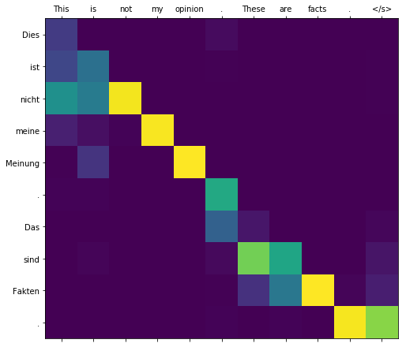
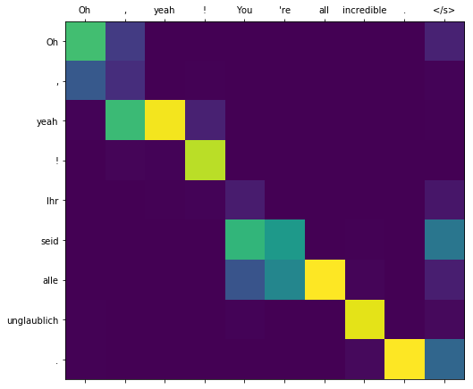

Introduction
============

In this repo we train neural machine translation (NMT) systems
using end-to-end networks on the IWSLT-2016 dataset. This corpus
consists of Ted Talks translated between German and English. The
utterances of each language are aligned, which allows us to use it to
train translation systems. We implement (1) a sequence to sequence model
as described by (Sutskever et al., 2014); (2) an attention model as
introduced by (Bahdanau et. al., 2014) with dot-product attention
computation as per (Luong et al., 2015); (3) beam search to improve
translation quality, and; (4) visualizations of how the attention
mechanism makes a soft-alignment between words in the source and target
sentences. We also experiment with the effects of batch size, masking
padding, and teacher forcing on the validation set perplexity.

Problem Description
===================

In machine translation, the objective is to translate sentences from a
source language into a target language. In NMT, we approach this task by
jointly training end-to-end deep neural networks to predict the
likelihood of a sequence of output target tokens given a sequence of
input tokens of a different language. More formally, we define machine
translation as translating a source sentence  = ,,
 =  into a target sentence  = ,, 
= . Using this notation, we can define a translation system
as the function

where  are the parameters of the model specifying the
probability distribution. We learn  from data consisting of
aligned sentences in the source and target languages. In the case of
this problem set, German is our source language and English is our
target language.

Models and Algorithms
=====================

In the encoder-decoder framework, an encoder reads an input sequence
into a context vector  and a decoder is trained to predict an output
token  given the context vector and all previously predicted
tokens . In
this way, the decoder defines a probability distribution over a
translation . Formally,

During generation for unlabeled input sequences, tokens are usually
output until an end-of-sentence token is output or a specified maximum
length is reached.

In the context of this homework, this conditional probability is modeled
using recurrent neural networks (RNN). With this being the case, we let
 =
 for simplicity where  is the hidden state of
the RNN and  is a nonlinear, possibly multi-layered function that
outputs the probability of  (Neubig, 2017).

Encoder-Decoder
---------------

Inspired by (Cho et al., 2014) and (Sutskever et al., 2014), the
name encoder-decoder comes from the idea that we can use a model of two
RNNs to translate between languages: one that processes an input
sequence  and “encodes” its information as a vector of real numbers
(hidden state), and another that is used to “decode” this vector to
predict the corresponding target sequence . In particular if we let
the encoder be expressed as RNN(), then the decoder is
expressed as RNN() and we can represent the overall model
for time step  as follows:

where  is the source language embedding lookup,
 is the encoder hidden state, 
is the source language embedding lookup,  is the
decoder hidden state, and  is the softmax to turn
’s hidden state into a probability.

Note that  is initialized to  and
 =  the encoder has seen all words in the
source sentence. In this setup, we are feeding the true  target
as the input to the decoder for time step . This is known as teacher
forcing. When we are not employing teacher forcing, as is the case in
some of our experiments,  
where  = , the most likely output
token from the previous time step ().

Attention Decoder
-----------------

To incorporate attention into our decoder, we redefine the conditional
probability of  to be

Here and unlike the formulation of  in previous sections, the
probability is conditioned on a distinct context vector  for each
target token . The context vector  depends on a sequence of
annotations , ,  to which an encoder maps the input
sequence. The context vector  is then computed as a weighted sum of
these annotations:

where

and

is an   which scores how well the inputs around
position  and the output at position  match. The alignment model
 is parametrized as a simple feedforward neural network that is
jointly trained with all other components of the translation system.
Note that the alignment is not a latent variable, which allows
backpropagation through this gradient due to its differentiability.
Intuitively,  reflects the importance of  with respect
to  in deciding  and generating . It is believed that
giving the decoder an attention mechanism relieves the encoder from
having to encode all information in the source sequence needed for
translation to a fixed-length vector (Bahdanau et al., 2014).

Beam Search
-----------

Since the model is only trained to predict the probability of the next
word at a given time step in the target sentence, a decoding procedure
is needed to produce an actual translation, where the goal is to
maximize the probability of all words in the target sentence:

The simplest approach is to proceed in a greedy fashion, taking the most
likely word under the model at each time step and feeding it back in as
the next input until the end-of-sentence token is produced:

This is not guaranteed to produce the highest-scoring sentence, though,
since in some cases the selection of a lower-probability word at a given
time-step will lead to downstream predictions that produce a
higher-scoring sentence overall. To account for this, we follow
(Sutskever et al., 2014) and use a beam search – instead of greedily
accumulating a single series of tokens across time-steps in the target
sentence, we instead keep track of a fixed-size set of candidate
decodings (the “beam”). At each step, we extend each candidate with all
words in the vocabulary, update the cumulative score for each new
candidate given the probabilities produced by the model, and then skim
off the  highest-scoring candidates to keep the size of the beam
constant. (Otherwise it would be a breadth-first search of all possible
permutations.) After the new beam is pruned, any candidates ending with
the end-of-sentence token are removed from the beam and added to a set
of completed candidates, and the beam size  is reduced by 1. This
continued until the beam is empty, and  complete candidate sentences
have been produced.

If the final set of candidate sentences is sorted on the summed
log-probabilities of each word, the procedure will strongly favor short
sentences, since the addition of each new word will drive down the joint
probability of the sentence. A range of strategies for length
normalization have been proposed, but we take the simplest approach,
which is to divide the total log-probability of the sentence by the
number of words to get an average per-word log-probability.

Following (Sutskever et al., 2014) we use beam size of 10. And, in the
interest of speed – when extending candidates with new words at each
time-step, we only consider the 1000 most frequent words under the
model, which gives a significant speedup at little or no cost in
accuracy.

Experiments
===========

We experimented with a number of modifications to the baseline attention
model:

1.  In addition to the standard approach for calculating attention where
    the hidden layer $h_t^e$ is dotted with the hidden states at each
    time-step from the encoder:

    

    We also implemented the attention scoring as a multi-layer
    perceptron as described by (Bahdanau et al., 2014):

    

2.  We tried a range of learning rate schedulers, which train for a fixed
    number of epochs (e.g., {4, 8, 10}) and then decay the learning rate by 
    a factor of 0.5 every _N_ epochs after
    that. We tried _N_ = {2, 3, 4}.

3.  We implemented the decoder as a bidirectional LSTM as described by
    (Bahdanau et al., 2014).

4.  Last, we experimented with a wide range of hyperparameter settings:

    -   Word embedding dimensions: 200, 300, 500.

    -   LSTM hidden layers: 1, 2, 4.

    -   LSTM hidden layer dimensions: 200, 500, 1000.

    -   SGD and Adam optimizers.

    -   Batch lengths of 32 and 64.

    -   Clipping gradients to 5.

Though we didn’t have the resources to conduct a full grid search across
all combinations of these architectures and parameters, our best
performing models used 2-layer LSTMs with dot-product attention. All
final models were optimized with SGD starting with a learning rate of 1.
Early stopping was used to identify the best-performing model on the
validation set.

*Model* | *Accuracy* |
:---: | :---: |
Encoder-Decoder | 15.612
Dot Attention – 300d embeddings, 500d LSTMs, Bidirectional encoder | 9.680
Dot Attention – 500d embeddings, 1000d LSTMs | 9.672
Dot Attention – 200d embeddings, 200d LSTMs | 9.636
Dot Attention – 300d embeddings, 500d LSTMs | **9.501**

Generally, we found that it was difficult to find a single learning rate
scheduler that worked well for different hyperparameter settings – a
decay rate that seemed to work well for the 500-unit LSTM seemed too
slow for the 200-unit model, etc. Given indefinite resources, ideally we
would run a broad grid search to pick the best model.

See the following sections for visualizations of the attention weights and comparisons between the translations produced by the beam coder and the Google Translate predictions.

Translation examples
====================

We can compare the translations produced by the beam search decoder to
the predictions from Google translate:

*Source* | *Our Model* | *Google*
:---: | :---: | :---: |
Arbeit kam später, Heiraten kam später, Kinder kamen später, selbst der Tod kam später. | work came later , `<unk>` came later later , children came later later , even the death came later . | Work came later, marriages came later, children came later, even death came later
Das ist es , was Psychologen einen Aha-Moment nennen. | That ’s what psychologists call a `<unk>` call . | That’s what psychologists call an aha moment.
Dies ist nicht meine Meinung. Das sind Fakten.| This is not my opinion . These are facts . | This is not my opinion. These are facts.
In den 20ern sollte man sich also weiterbilden über den Körper und die eigenen Möglichkeiten | So in the `<unk>` , you should be thinking about the body and the own possibilities . | In the 20’s you should continue to educate yourself about the body and your own possibilities
Wie würde eine solche Zukunft aussehen? | What would such a future look like ? | What would such a future look like?

Attention visualizations
========================

We can visualize the dot-product attention by plotting the weights
assigned to the encoder hidden states for each step during decoding.

  'Dies ist nicht meine Meinung. Das sind Fakten' --> 'This is not my opinion. These are facts.'
  

  'Oh, yeah! Ihr seid alle unglaublich' --> 'Oh, yeah! You're all incredible.'
  

Conclusion
==========

We trained two classes of models – a basic encoder-decoder architecture
as described by (Sutskever et al., 2014) and a series of models that use
dot-product attention to give the decoder a more flexible representation
of the input. Though we experimented with more complex architectures such as
bidirectional LSTMs with multilayer perceptrons for attention weighting, our best-performing models used the basic dot-product attention.

References
==========

Bahdanau, D., Cho, K. & Bengio, Y. Neural Machine Translation by Jointly
Learning to Align and Translate. doi:10.1146/annurev.neuro.26.041002.131047. 2014.

Cho, K. et al. Learning Phrase Representations using RNN Encoder-Decoder
for Statistical Machine Translation. doi:10.3115/v1/D14-1179. 2014.

Luong, M.-T., Pham, H. & Manning, C. D. Effective Approaches to
Attention-based Neural Machine Translation. doi:10.18653/v1/D15-1166. 2015.

Neubig, G. Neural Machine Translation and Sequence-to-sequence Models: A
Tutorial. 2017.

Sutskever, I., Vinyals, O. & Le, Q. V. Sequence to sequence learning
with neural networks. Advances in Neural Information Processing Systems
(NIPS), pages 3104–3112. 2014.
